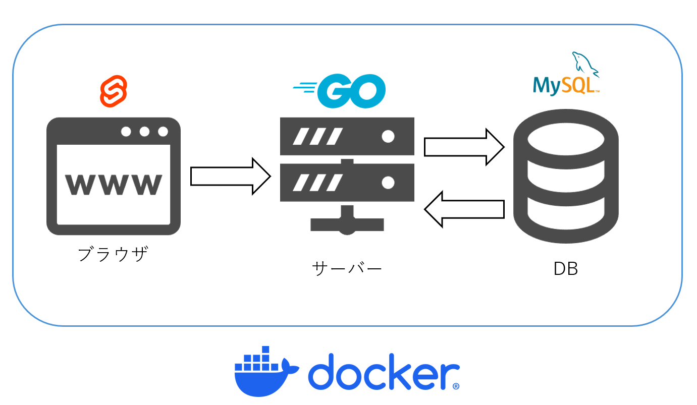

# GYOUJI_HP

仙台高専広瀬行事委員会広報用HP



## アプリ基本設計書

## 1. アプリ概要

### 1.1. アプリ名

行事委員会紹介＋秋季スポーツ大会トーナメント結果速報アプリ

### 1.2. 目的

学校のスポーツ大会において、学生がリアルタイムで試合結果を把握できるようにすることで、大会参加への関心と一体感を高める。

### 1.3. ターゲットユーザー

管理者 (`superroot`, `admin`): 行事委員会のメンバー

一般ユーザー (`student`): 大会に参加・観戦する全学生

### 1.4. 技術スタック

- フロントエンド: `SvelteKit`
- バックエンド: `Gin` (`Go`)
- データベース: `MySQL`
- その他: `Docker`による環境構築を推奨

## 2. 機能要件

### 2.1. ユーザー種別と権限

|ユーザー識別 | 認証方法 | 主な権限 |
| --- | --- | --- |
| `superroot` | 個別ID/パスワード | 全競技の試合結果登録・編集・管理者アカウントの管理 |
| `admin` | 競技ごとに発行された個別ID/パスワード | 担当競技の試合結果の登録・編集 |
| `student` | 全員共通のゲストパスワード | 全トーナメントの閲覧 |

### 2.2. 主な機能一覧

全ユーザー共通

- トップページ（行事委員会紹介）の閲覧
- ログイン機能

管理者 (`superroot`, `admin`)

- 担当競技のトーナメント一覧表示
- 試合ごとのスコア入力・更新機能
- 全競技のトーナメント表の閲覧
- 試合結果のリアルタイム確認
- `superroot`のみ: 順位の表示・非表示の切り替え,出席点入力・編集

一般ユーザー (`student`)

- 全競技のトーナメント表の閲覧
- 試合結果のリアルタイム確認

### 2.3. 特記事項（天候）

- 雨天時: 8人制サッカーは中止。卓球は「雨天時トーナメント」に切り替わる。
- 晴天時: 全てのトーナメントが実施される。

### 2.4. 得点システム

それぞれのクラスに点数を設定。

- `superroot`はそれぞれのクラスの出席点(0点から10点の範囲)を入力・DB登録できる。
- 各競技で一勝する度に勝利したクラスに10点加算(決勝は含まない)
- それとは別にベスト4には点数加算(一位は80点、二位は60点、三位は50点、四位は40点)
- 一位になったらひと競技当たり合計`10+10+10+80`で110点が加算される。
- 卓球の雨天時の敗者復活戦はブロックで一位になると10点が加算される。(それ以前に負けた場合は点数に加算されない)
- 総合得点が同じクラスがある場合、同率一位とする。

## 3. ローカル開発環境のセットアップ

### 3.1. 前提条件

以下のソフトウェアがインストールされている必要があります：

#### 必須ソフトウェア

導入に関しての例は[こちら](./setup.sample.md)を参考にしてください

- **`Docker & Docker Compose`**
  - [`Docker Desktop`](https://www.docker.com/products/docker-desktop/) をインストール
  - インストール後、`docker --version` と `docker compose version` でバージョンを確認

- **`Node.js` & `npm`**
  - [`Node.js`](https://nodejs.org/) (推奨: LTS版)
  - インストール後、`node --version` と `npm --version` でバージョンを確認

- **`Go`**
  - [`Go`](https://golang.org/dl/) (推奨: 1.21以上)
  - インストール後、`go version` でバージョンを確認

### 3.2. プロジェクトのクローンと初期設定

```bash
# リポジトリをクローン
git clone <repository-url>
cd GYOUJI_HP # GYOUJI_HP

chmod 600 ./letsencrypt/acme.json

cd frontend # GYOUJI_HP/frontend
npm install

cd ../backend # GYOUJI_HP/backend
go mod tidy

# 環境変数ファイルの作成
cd ../ # GYOUJI_HP
cp .env.sample .env

cp backend/.env.sample backend/.env

cp frontend/.env.sample frontend/.env
```

### 3.3. 環境変数の設定

`.env`ファイルを編集して、以下の環境変数を設定してください：

```env
LETSENCRYPT_EMAIL=<あなたのメールアドレス>

# Database Configuration
DB_HOST=db
DB_PORT=3306
DB_USER=root
DB_ROOT_PASSWORD=<安全なパスワード>
DB_DATABASE=gyouji_hp

# Table Names
TABLE_USERS=users
TABLE_TOURNAMENTS=tournaments
TABLE_TEAMS=teams
TABLE_MATCHES=matches

# JWT Secret Key
JWT_SECRET_KEY=<安全なbase64エンコードされた32文字の文字列>
```

`backend/.env` ファイルを編集して、以下の環境変数を設定してください：

```env
# Superroot管理者アカウント
SUPERROOT_USER=superroot
SUPERROOT_PASS=<your_superroot_password>

# 各競技の管理者アカウント
ADMIN_TABLE_TENNIS_USER=admin_table_tennis
ADMIN_TABLE_TENNIS_PASS=<your_table_tennis_password>

ADMIN_VOLLEYBALL_USER=admin_volleyball
ADMIN_VOLLEYBALL_PASS=<your_volleyball_password>

ADMIN_SOCCER_USER=admin_soccer
ADMIN_SOCCER_PASS=<your_soccer_password>

ADMIN_RELAY_USER=admin_relay
ADMIN_RELAY_PASS=<your_relay_password>

# 学生用共通パスワード
STUDENT_USER=student
STUDENT_PASS=your_student_password
```

`frontend/.env` ファイルを編集して、以下の環境変数を設定してください：

```env
# 開発環境設定
VITE_API_BASE_URL=http://localhost:8080/api
VITE_APP_TITLE=Tournament Management System
VITE_ENABLE_POLLING=true
VITE_POLLING_INTERVAL=30000
```

`JWT_SECRET`は次のコマンドで生成するとよい

```bash
openssl rand -base64 32
```

opensslがなければ`apt`でインストールしよう

安全なパスワードは以下のコマンドで生成すると良い

```bash
openssl rand -base64 48 | cut -c1-16
```

### 3.4. アプリケーションの起動

#### Dockerを使用した起動（推奨）

```bash
# データベースとバックエンドを起動
docker compose up -d --build
```

### 3.5. アクセス方法

起動後、以下のURLでアクセスできます：

- **フロントエンド**: [http://localhost:3300](http://localhost:3300)
<!-- - **Swagger UI**: [http://localhost:3300/swagger/index.html](http://localhost:3300/swagger/index.html) -->

### 3.6. データベース操作

#### データベースコンテナに接続

```bash
# バックエンドとフロントエンドのビルド
docker compose build --no-cache

# MySQLコンテナに接続
docker compose exec db mysql -u root -p

# パスワードを入力（.envのDB_PASSWORDの値）
# データベースを選択
USE gyouji_hp;

# テーブル一覧を表示
SHOW TABLES;

# 特定のテーブルの内容を確認
SELECT * FROM users;
SELECT * FROM teams;
SELECT * FROM team_points;
```

#### データベースの初期化

```bash
# コンテナを停止・削除してデータベースをリセット
docker compose down -v

# バックエンドとフロントエンドのビルド
docker compose build --no-cache

# 再起動（初期データが自動で投入される）
docker compose up -d --build

# 再起動後バックエンドが正しく起動できていない場合がある(ログインできない等)
# 再起動（再起動することで改善されることがある）
docker compose ip -d --build
```

### 3.7. 開発時のTips

#### ログの確認

```bash
# 全サービスのログを確認
docker compose logs -f

# 特定のサービスのログのみ確認
docker compose logs -f backend
docker compose logs -f db
```

#### コンテナの状態確認

```bash
# 実行中のコンテナを確認
docker compose ps

# コンテナを停止
docker compose stop

# コンテナを完全に削除（データも削除）
docker compose down -v
```

#### バックエンドの再ビルド

```bash
# バックエンドのコードを変更した場合
docker compose build backend
docker compose up -d backend
```
