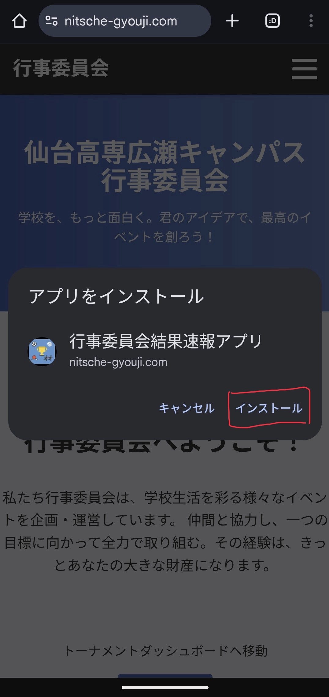

# 結果速報webアプリの使い方

これは、全体大会のEXCELの結果速報をwebアプリ化したものである。  
以下のURLまたはQRコードからアクセスできる。

[https://nitsche-gyouji.com](https://nitsche-gyouji.com)

  

## 1. ログイン

**ログインボタン**をクリック。

メールに記載されている**ユーザー名**と**パスワード**を入力後、ログインボタンをクリック。

## 2. ダッシュボード

それぞれのトーナメントが更新されていきます。

## 3. 得点

それぞれのクラスの得点と順位を確認できます。   
当日15時から総合点及び順位を非表示にします。

## 4. PWA

今回のこのwebアプリはモバイルアプリとしてもご利用いただけます。  
ぜひご活用ください。

### iOS

### Android

---

インストール後、アイコンが表示されます。そのアイコンをクリックすることで、アプリを起動できます。